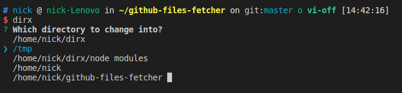

# dirx [](https://opensource.org/licenses/MIT)
Select a directory from an options list and change into it.

# Install

```bash
$ npm install -g dirx
$ dirx-cli install

$ git clone https://github.com/Gyumeijie/dirx.git
$ cd dirx
$ npm install
$ ./install.sh
```
> If `dirx not found`, please try to reopen a new terminal.

# Usage

```
$ dirx-cli
Usage:
      dirx-cli install | uninstall
      dirx-cli set-strategy strategy("frequency" or "accessTime")
      dirx|d -c 
```


```bash
$ dirx
```



# Feature

Support sorting accessed directories by `frequency` and `access time`. You can use different sorting strategy by:

```bash
$ dirx-cli set-strategy "frequency"

$ dirx-cli set-strategy "accessTime"
```
